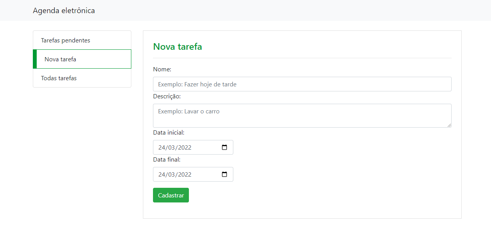
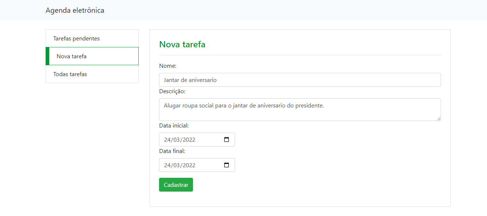
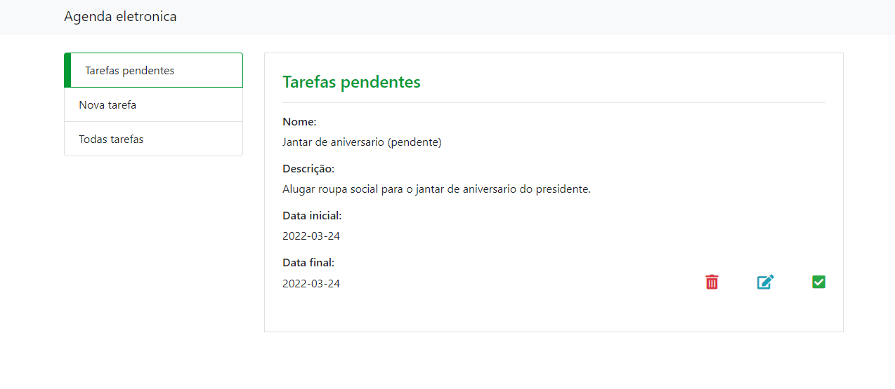
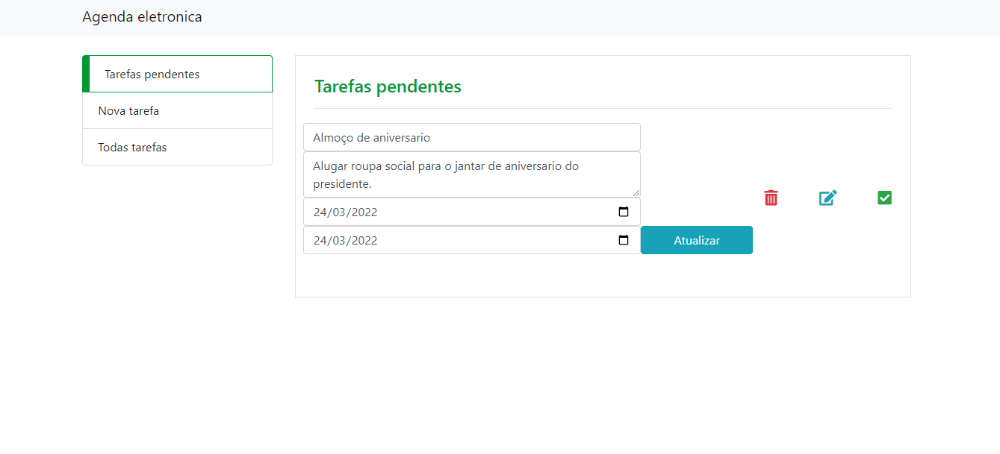
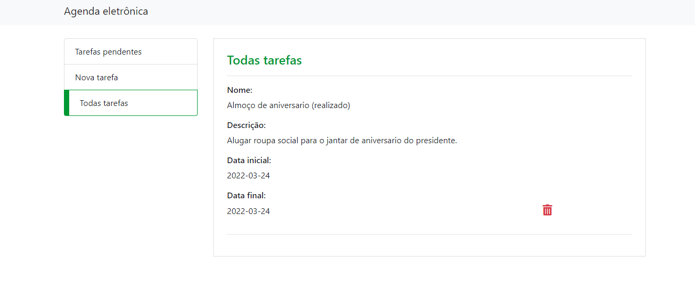
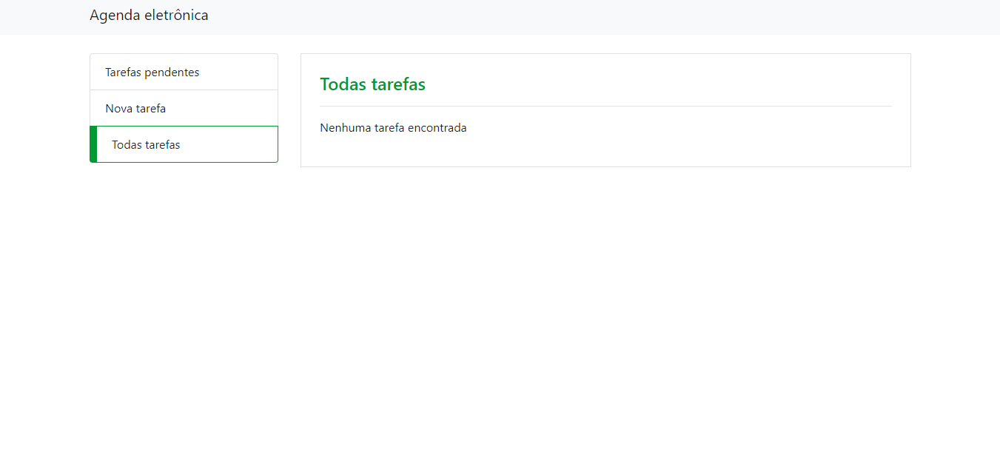

# 📅Agenda Eletrônica

<!---Esses são exemplos. Veja https://shields.io para outras pessoas ou para personalizar este conjunto de escudos. Você pode querer incluir dependências, status do projeto e informações de licença aqui--->




> Com a agenda eletrônica você pode adicionar as suas tarefas e determinar um prazo, como tambem mudar os status dela.


# 💻 Pré-requisitos

Antes de começar, verifique se você atendeu aos seguintes requisitos:

* Você precisa ter  `< PHP 7.4 + / Apache 2.4 /MySQL>`

# 🚀 Instalando a Agenda Eletronica

Para instalar a Agenda, siga estas etapas:

É necessário que você mova os arquivos do repositorio para a pasta dentro do seu programa servidor web( WAMP, LAMP OU MAMP),como o XAMPP - na pasta htdocs - ou WAMP - na pasta www. 
e no navegador colocar o PATH.

```
http://localhost/example/public/index.php
```

# ☕ Usando Agenda Eletrônica

Para usar Agenda, siga estas etapas:

 --> crie a base de dados , segue o [Modelo](db.sql)

## Para inserir a tarefa:



>Preencha todos os campos para ter uma expêriencia completa, ao colocar os dados clique em "cadastrar".

## Para atualizar a tarefa:



>Então estamos na pagina 'Tarefas pendentes", aqui estão as atividades que não foram concluidas ainda. Qualquer dado pode ser atualizado só basta clicar no editar(botão azul). 



>Apos clique no botão "atualizar", o status localizado entre parênteses "(pendente)", só é alterado quando se clica no check(botão verde), e não estará disponível a opção de desfazer o status (realizado) ou atuilizar a atividade quando estiver realizada.

## Para mudar o status:



>Ao mudar o status da pagina para (realizada) ela não poderá ser atualizada e será removida da página "Tarefa pendentes"
## Para excluir a tarefa


> Quando atualizar, mudar o status ou simplismente excluir sumirá tanto de todas as tarefas e se seu status for pendente sumirá de "Tarefas pendentes" também. 



# 🤝 Autor

<table>
  <tr>
    <td align="center">
      <a href="#">
        <br>
        <sub>
          <b>Rafael Tomás</b>
        </sub>
      </a>
    </td>
    
  </tr>
</table>
	
  <a href="https://www.linkedin.com/in/rafaeltomass/" target="_blank"></a> 
